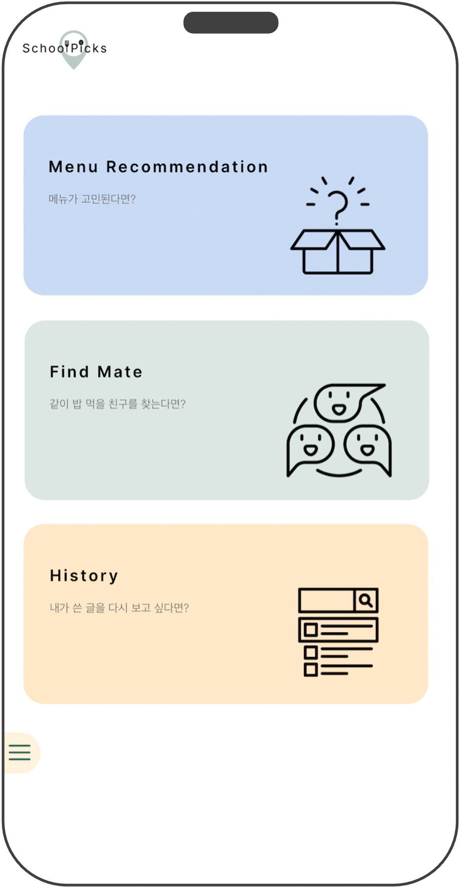
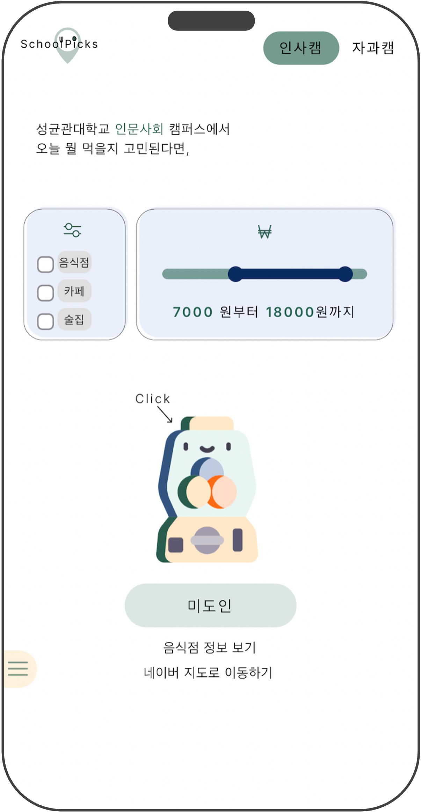
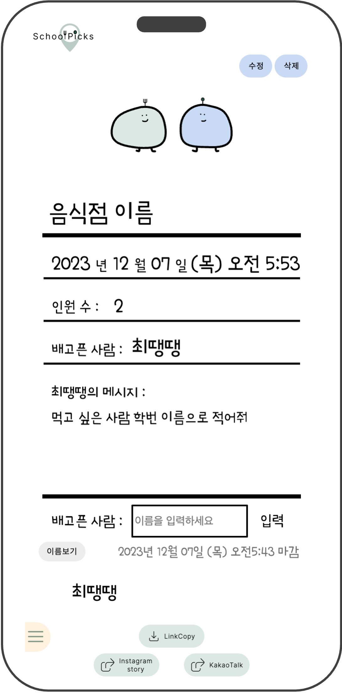
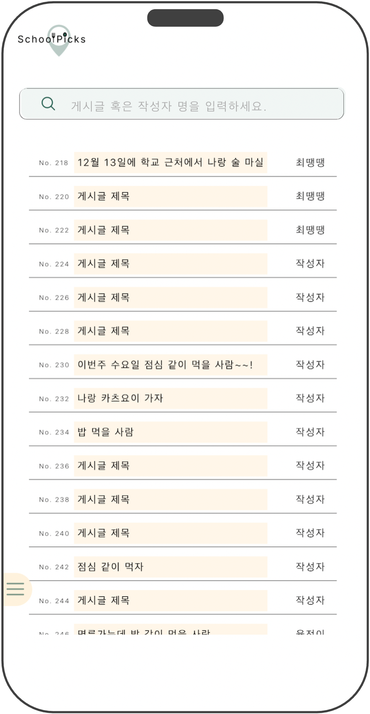
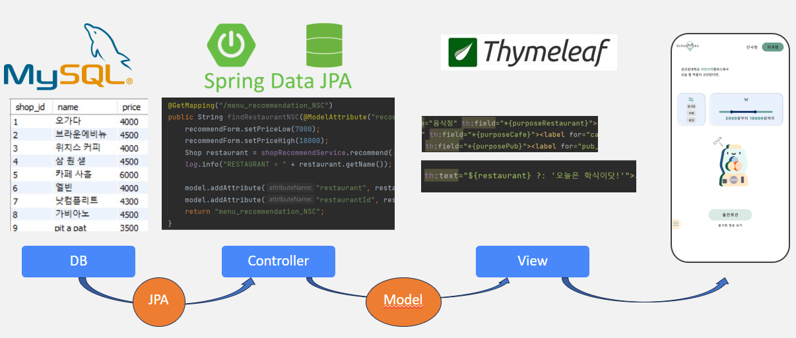

# SchoolPicks


<br><br>

## :book: Project
- SKKU CapstonProject
- Development period: 2023.09.08. ~ 2023.12.07.

| 최연서 (Front-end)                                                                                | 서강덕 (Front-end)                                                                                   | 백명규 (Back-end)                                                                                                           | 이재홍 (Back-end)                                                                                                |
|------------------------------------------------------------------------------------------------|---------------------------------------------------------------------------------------------------|--------------------------------------------------------------------------------------------------------------------------|---------------------------------------------------------------------------------------------------------------|
| - UX/UI Design<br/>- Implement 3th func<br/>- KakaoTalk share API(func.)<br/>- Default setting | - UX/UI Design<br/>- Implement 2th func<br/>- Clipboard & Button func<br/>- Alert & disabled func | - Connect MySQL and Spring<br/>- Implement Recommendation<br/>- Testcase & Bug fix<br/>- Expired Time & Show/Blind Func. | - Connect Spring and Front<br/>- Implement 2th func.<br/>- Insta share API(func.)<br/>- Implement detail page |


<br>

## :hamburger: Functions

### Fun and Random Recommendation
When we think about what to eat, it recommends a restaurant in various ways to convey information about meals

### Simply Find Mate
If you are looking for friends to eat with, you can simply find friends using the simply designed personal page

### Helpful History
You can search past posts and reviewing them again will help to find meal mate successfully


<br>

## :rocket: Start Guide
### Programming Requirements
- `JAVA` [JDK-11]
- `mySQL`
- `IntelliJ`

### Install
```
$ git clone https://github.com/PaikMyeongGyu/Capston-Project-SchoolPicks.git
$ cd Capston-Project-SchoolPicks
```

### Run
- Before starting program, run the `mySQL` server
- start IntelliJ and open the file `build.gradle`
- In the file `src/main/resources/application.properties` change 'username' and 'password' to your `mySQL` information
- In the same file `spring.jpa.hibernate.ddl-auto=none`, change `none` to `create`
  - It is to put in dummy data
- In the file `src/test/java/com.example.demo/DataInjectinoTest` run the all classes
- In the file `src/main/resources/application.properties` `spring.jpa.hibernate.ddl-auto=create`   re-change `create` to `none`
- In `src/main/java/com.example.demo/DemoApplication`, run `main()` function.
- Go to Chrome and put `localhost:8080` into URL
<br>


## :school: Tech Stacks


<br>


<br>


<br>

## :computer: Screen


| Main Menu                                               | Recommendation                                          | Find Mate                                               | Histroy                                                 |
|---------------------------------------------------------|---------------------------------------------------------|---------------------------------------------------------|---------------------------------------------------------|
|  |  |  |  |


<br>

## :dart: Key Features

### Fun and Random Recommendation
- You can choose whether to be recommended for restaurants around the Seoul campus or the Suwon campus.
- You can choose from 3 categories: restaurant(음식점), cafe(카페), and bar(술집).
  - If you choose nothing, it is recommended regardless of the category.
- You can get recommendations within the budget using the two-way slider.
- The recommended restaurant changes every time you click on the vending machine.
  - This is a random restaurant correspond to categories and price filters.
- After the recommendation , you can get detailed information about the restaurant and go to 'Naver Map'
  - (Information on the exact location of the restaurant and many reviews can be obtained after going to the Naver Map.)

### Simply Find Mate
- When you click on the Find Mate menu, you can see the form.
- You can choose one of the 3 concepts.
- You should write down the title of the post, the name of the restaurant, the writer’s name, a brief message as a room manager, and password for edit.
- The post title and writer's name will be used as a search term later when you want to see what you wrote again.
- You can choose whether to show others the names of friends who want to eat with you for privacy.
- Once you have completed the form, click the complete button.
- If you like just this page without any modifications, you can share this completed page through Clipboard, Instagram Stories, or KakaoTalk.

### Helpful History
- If you click the 3rd menu, you can see all posts by everyone.
- Among all posts, you can search by writer’s name and post title to revisit and manage posts you wrote in the past.

<br>

## :mag: Work Flow

